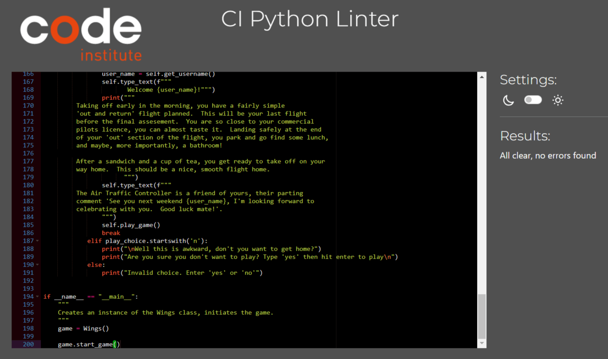
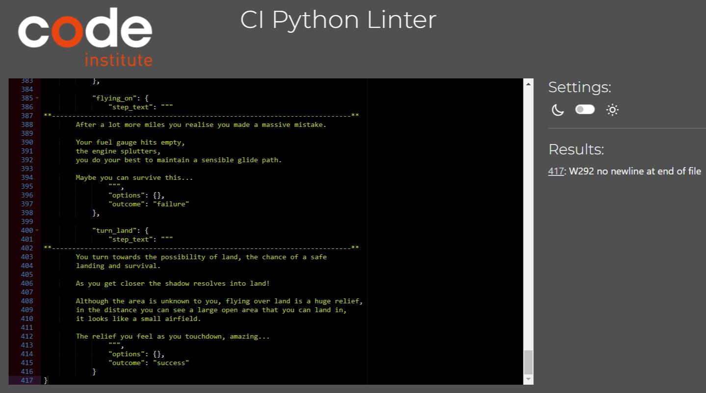

# Wings
## Can you survive?

[Link to live Website](https://wings-text-based-game-866d46ea2c76.herokuapp.com/)
---

## Purpose

"Wings" is a text-based adventure, with retro vibes, written and executed using Python and run within Code 
Institutes mock terminal using the Heroku platform.

It is an interactive game, that the user interacts with by selecting from two options, each option has a consequence
of some sort, some are 'win' outcomes, some result in 'loose' outcomes, and some keep the adventure going.  It is,
in essence, a 'choose your own' adventure.

## How to play

The game is based on "Choose your own adventure" books from the 80's and 90's, you can read more about
the books here: [Wikipedia](https://en.wikipedia.org/wiki/Choose_Your_Own_Adventure)

#### Steps for playing:
* Upon entering the game space you are asked if you want to proceed.
* Promted to enter your name, there are several validation stages to ensure a valid name entry, each will repromt if error triggered.
* Enter the game space.
* Promted to start making your choices.
* The last step repeats until you end the adventure through either success or failure.
* A different conclussion shows depending on success or failure.
* You are promted to choocse between restart or stop.
* If you restarted the game loops back to the beginning.

## Features

### Exhisting Features

#### Welcome Screen

* You are greeted with an ascii-art image, and a 'typewriter' style printed message welcoming you and inviting you to play the game.
* A goal statement is also printed.

 

#### Start Game

* After selecting 'yes' the game begins.
* You are promted with a username entry, here there are multiple validation steps to ensure valid entry.
* If you selected 'no' there is a querry if this was accurate.

 

#### Story

* After a valid name entry you are greeted and introduced to the outline of the game.
* There is a little background text here explaining where you are.
* Then you find yourself making the decisions, the input required is based on binary, option 1 or 2, your choice will 
lead on to success or failure.

 

#### Conclusion

* As you progress through the story you will reach 'end points', some of these are win conditions, some are loose conditions.
* Both have unique statements on completion.
* After you have seen a completion screen you are presented with an option to play again, or quit.

 

 

 

### Future Features

* Add colour to make the game look better.
* Use an API link google sheets to rework and extend the story line.
* Impliment scoreboard tracking individual players.
* Make game so multiple people are capable to play and track their scores, comparing to other players.

## Data Model

Before I started thinking about the code I used a flowchart to design the story arc, from the entry point to the end points.  This
allowed me visualise the paths I needed to create to ensure a good flow, it also allowed me to back-track when bug testing and discover
where I had made mistakes.

 

Once I had created the flowchart, I started writing the code:

* ##### Class
I created a single class that interacts with the story dictionary I have created.  Using a class allows me to encapsulate the both
the functionality and the story.

* ##### Dictionary
I used a dictionary to store the story text and allow me to structure it so that it can flow.  It also allowed me to separate the games
'logic' from it's 'data'.

The dictionary contains the game's story line, choices, and outcomes structured as follows:

* Values: Dictionaries containing:
    - "step_text": Text describing the current step.
    - "options" (Dictionary): Available choices and their corresponding steps.
    - "outcome": Outcome of the current step ("success" or "failure").
* Keys: Strings representing different steps in the game.

* ##### Logic
    - Functions: To keep code readable and reusable, functions(play_game, display_intro, start_game, get_username) are used to display the game's introduction and loop through the game's story, displaying text, options, and handle user choices, leading to different outcomes.
    - Input Validation: Each user input is validated and handled raising appropriate error depending on game stage and option to re-enter user input is provided if it is invalid.

* ##### Structure
    - Separation of Concerns: Separated the game logic from the data(story line) and the presentation (text-based input and output) to follow a good design practice and keep code well-maintained.
    - The game defines various locations and sub locations, and the player can navigate through these
areas based on their choices. The game uses text-based print statements to provide descriptions, dialogues, and narrations to convey the story and set more engaging atmosphere.

## Testing

* I have considered running this program through lighthouse to check the accessability rating and performance output, but decided not to
because this app is not designed to be responsive, it runs in a third party terminal created by Code Institute.

#### Manual Testing

* I have personally tested the input for name entry in as many ways as I could think of:
    - At the username input stage:
        - I have inserted empty space into a string.
        - I have left the entry blank.
        - I used less letters than minimum.
        - I have used special characters.
    - At the options input stage:
        - I have tried using non-numeric characters.
        - I have left the entry blank.
        - I have tried special characters.
    - At the replay input stage:
        - I have tried using non-numeric characters.
        - I have left the entry blank.
        - I have tried special characters.

    In all cases I expected to be reprompted to enter, and I was.

* Code :
    - Python code is tested using Code Institute PYTHON LINTER, with no errors. Code passed through and confirmed no problems.

######    run.py result:

 

######    story.py result:

 

### Testing for storyline

User testing:

* I want to understand the purpose of the site/game.
    - The ascii code art and welcome screen shows the user what the site/game is about.
* I want the navigation to be intuitive and easy to understand.
    - The user is provided with easy to understand options and easily navigable interface.
* I want to be able to decide to start the game, and not worry about captalisation or typing yes/no.
    - The user can opt in or out of the game, although they will be re-promted in case of an error, username can be entered lowercase or
        captilised, or uppercase for the really bold statement.  Yes/No options can be typed in full or as a simple y/n.
* I want to be able to enter my name and have it acknowledged.
    - The user can enter their name, it will be checked for a validitiy, then they will be welcomed and inserted into the story line.
* I want to be able to keep story flowing and recieve a message at the conclusion of the storyline.
    - The user drives the story, their input at the options section is how the story line is generated, whether positive or negative there
        is an end screen for the game.
* I want to play again.
    - Whether you win or loose the user will be promted with the option to replay, depending on the choice the game will either replay
        or terminate.
* I want replay-ability.
    - The user drives the story line, there are multiple conclusions to play through.

## Bugs

I had to run the code through the Code Institutes pep8 checker multiple times:
* First run, it came back with dozens of errors, mostly blank space on story.py.
    - Fixed the blank space errors with patience and carefully checking each line - these errors occured because I copied text from the google sheets doc I used.
* Second run, it returned a couple of undefined variables on story.py.
    - Fixed these by checking I had copied the variable names and replacing them where needed.
* Third run, switching to run.py, I had very similar issues to those I experienced with story.py.
    - Fixed these by again checking line by line for white space, no syntax errors this time though.

Once everything passed the Code Institute pep8 checker I deployed, and the next round of checks began:

This time I had to fix a couple of syntax errors, I had forgotten to change the variable names from the story.py...

## Unfixed Bugs

There seems to be one error that is inherant in text based apps, the user can interfere with the display by hitting letters on the keyboard
while the text is being generated.  I am sure there is a solution but I haven't found one so for now it remains.

# Technologies

This is a list of technologies used during the construction and testing of the site:
***
* [Gitpod](https://gitpod.io/workspaces) IDE to develop the website.
* [Github](https://github.com/Swewi) To host the source code and GitHub Pages to deploy and host the live site.
* Git to provide version control (to commit and push code to the repository).
* Code Institute's Gitpod Template to generate the workspace for the project.
* [Ascii art](https://asciiart.website/index.php?art=transportation/airplanes) Used to create the ASCII airplane.
* [Ascii art archive](https://www.asciiart.eu/text-to-ascii-art) Used to create the ASCII words.
* [ViewPDF](https://www.viewpdf.com/result.html?e=0&c=pdf-to-images#) Converts PDF to JPG.
* [Bytesresponsive](https://bytes.dev/?s=amiresponsive) Used to create responsive image.
* [TinyJPG](https://tinyjpg.com/) To compress images for README.
* [ChatGPT](https://chat.openai.com/) Used for spelling, grammer, and readability checks.
* [Code Institutes pep8 checker](https://pep8ci.herokuapp.com/) Used to check the python code.
* [Mural](https://app.mural.co/t/wingspythonproject38385/home) USed to create the flow chart.

### Imports and Repositories Used

* sys: used for handling standard input and output streams during typewriter effect.
* time: used for controlling the timing of text output game for typewriter effect.
* [Wings Repo](https://github.com/Swewi/Wings-text-based-game/tree/main)

# Deployment
## Cloning the Repository

* On Github navigate to the repository "https://github.com/Swewi/Wings-text-based-game/tree/main"
* Click "Code" drop down menu - a green button shown right above the file list.
* Copy the URL of the repository using "HTTPS", "SSH" or "Github CLI".
* Open Git Bash.
* Change the current working directory to the location where you want the cloned directory.
* Type "git clone", and then paste the URL copied earlier.
* Press enter to create local clone. A clone of the repository will now be created.

* For more details on how to clone the repository in order to create a copy for own use refer to the site:
[Cloning a Repository](https://docs.github.com/en/repositories/creating-and-managing-repositories/cloning-a-repository)

## Forking a Repository

* On Github navigate to the repository "https://github.com/Swewi/Wings-text-based-game/tree/main"
* Click "Fork" located towards top right corner on GitHub page.
* Select "owner" for the forked repository from the dropdown menu under "owner".
* It will create forked repo under the same name as original by default. But you can type a name in "Repository name" or add a description in "Description" box.
* Click on "Create fork". A forked repo is created.

###### Important Information about forking a repository
* Forking allows you to make any changes without affecting original project. You can send the the suggestions by submitting a pull request. Then the Project Owner can review the pull request before accepting the suggestions and merging them.
* When you have fork to a repository, you don't have access to files locally on your device, for getting access you will need to clone the forked repository.
* For more details on how to fork the repo, in order to for example suggest any changes to the project you can:
[Forking a Repository](https://docs.github.com/en/get-started/quickstart/fork-a-repo)

