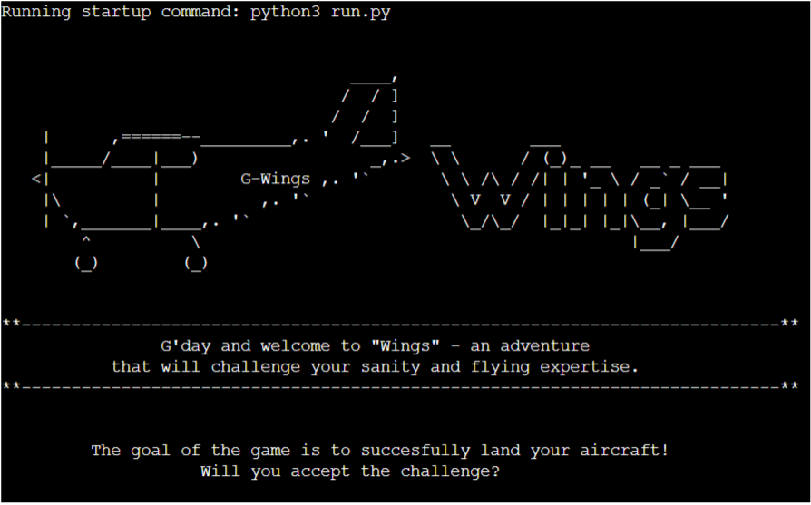
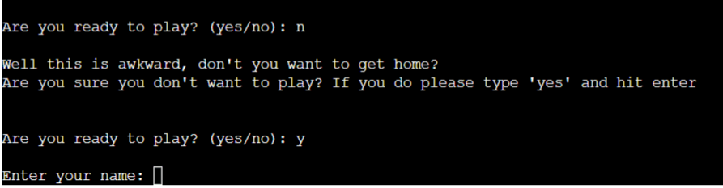
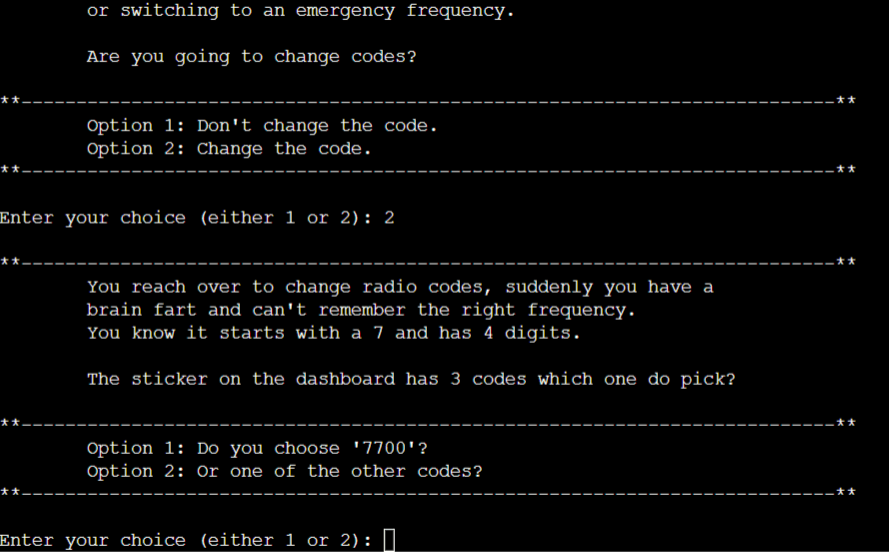
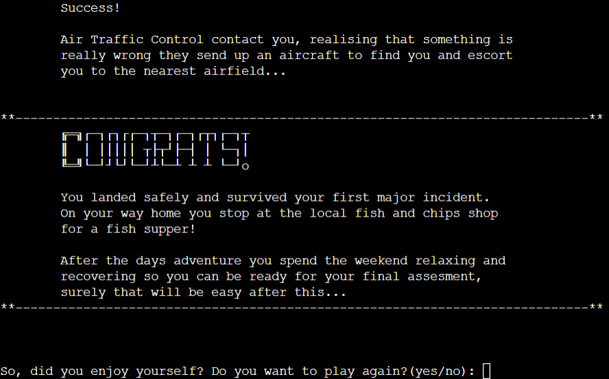
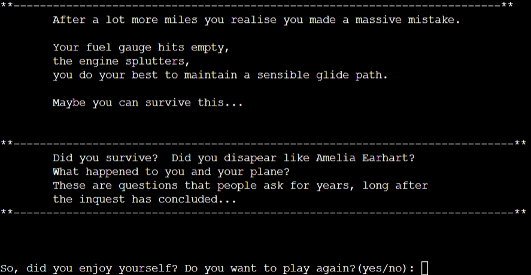
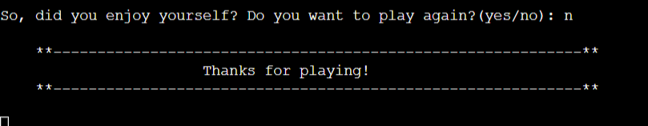
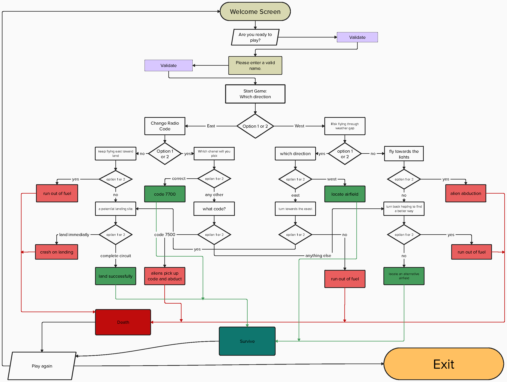

# Wings
## Can you survive?

[Link to live Website](https://wings-text-based-game-866d46ea2c76.herokuapp.com/)
---

## Purpose

"Wings" is a text-based adventure, with retro vibes, written and executed using Python and run within Code 
Institutes mock terminal using the Heroku platform.

It is an interactive game, that the user interacts with by selecting from two options, each option has a consequence
of some sort, some are 'win' outcomes, some result in 'loose' outcomes, and some keep the adventure going.  It is,
in essence, a 'choose your own' adventure.

## How to play

The game is based on "Choose your own adventure" books from the 80's and 90's, you can read more about
the books here: [Wikipedia](https://en.wikipedia.org/wiki/Choose_Your_Own_Adventure)

#### Steps for playing:
* Upon entering the game space you are asked if you want to proceed.
* Promted to enter your name, there are several validation stages to ensure a valid name entry, each will repromt if error triggered.
* Enter the game space.
* Promted to start making your choices.
* The last step repeats until you end the adventure through either success or failure.
* A different conclussion shows depending on success or failure.
* You are promted to choocse between restart or stop.
* If you restarted the game loops back to the beginning.

## Features

### Exhisting Features

#### Welcome Screen

* You are greeted with an ascii-art image, and a 'typewriter' style printed message welcoming you and inviting you to play the game.
* A goal statement is also printed.

 

#### Start Game

* After selecting 'yes' the game begins.
* You are promted with a username entry, here there are multiple validation steps to ensure valid entry.
* If you selected 'no' there is a querry if this was accurate.

 

#### Story

* After a valid name entry you are greeted and introduced to the outline of the game.
* There is a little background text here explaining where you are.
* Then you find yourself making the decisions, the input required is based on binary, option 1 or 2, your choice will 
lead on to success or failure.

 

#### Conclusion

* As you progress through the story you will reach 'end points', some of these are win conditions, some are loose conditions.
* Both have unique statements on completion.
* After you have seen a completion screen you are presented with an option to play again, or quit.

 

 

 

### Future Features

* Add colour to make the game look better.
* Use an API link google sheets to rework and extend the story line.
* Impliment scoreboard tracking individual players.
* Make game so multiple people are capable to play and track their scores, comparing to other players.

## Data Model

Before I started thinking about the code I used a flowchart to design the story arc, from the entry point to the end points.  This
allowed me visualise the paths I needed to create to ensure a good flow, it also allowed me to back-track when bug testing and discover
where I had made mistakes.

 

Once I had created the flowchart, I started writing the code:

* ##### Class
I created a single class that interacts with the story dictionary I have created.  Using a class allows me to encapsulate the both
the functionality and the story.

* ##### Dictionary
I used a dictionary to store the story text and allow me to structure it so that it can flow.  It also allowed me to separate the games
'logic' from it's 'data'.

The dictionary contains the game's story line, choices, and outcomes structured as follows:

* Values: Dictionaries containing:
    - "step_text": Text describing the current step.
    - "options" (Dictionary): Available choices and their corresponding steps.
    - "outcome": Outcome of the current step ("success" or "failure").
* Keys: Strings representing different steps in the game.

* ##### Logic
    - Functions: To keep code readable and reusable, functions(play_game, display_intro, start_game, get_username) are used to display the game's introduction and loop through the game's story, displaying text, options, and handle user choices, leading to different outcomes.
    - Input Validation: Each user input is validated and handled raising appropriate error depending on game stage and option to re-enter user input is provided if it is invalid.

* ##### Structure
    - Separation of Concerns: Separated the game logic from the data(story line) and the presentation (text-based input and output) to follow a good design practice and keep code well-maintained.
    - The game defines various locations and sub locations, and the player can navigate through these
areas based on their choices. The game uses text-based print statements to provide descriptions, dialogues, and narrations to convey the story and set more engaging atmosphere.

## Testing

* I have considered running this program through lighthouse to check the accessability rating and performance output, but decided not to
because this app is not designed to be responsive, it runs in a third party terminal created by Code Institute.

#### Manual Testing

* I have personally tested this is as many ways as I could think of:
    - At the username input stage:
        - I have inserted empty space into a string.
        - I have left the entry blank.
        - I used less letters than minimum.
        - I have used special characters.

In all cases I expected to be reprompted to enter, and I was.